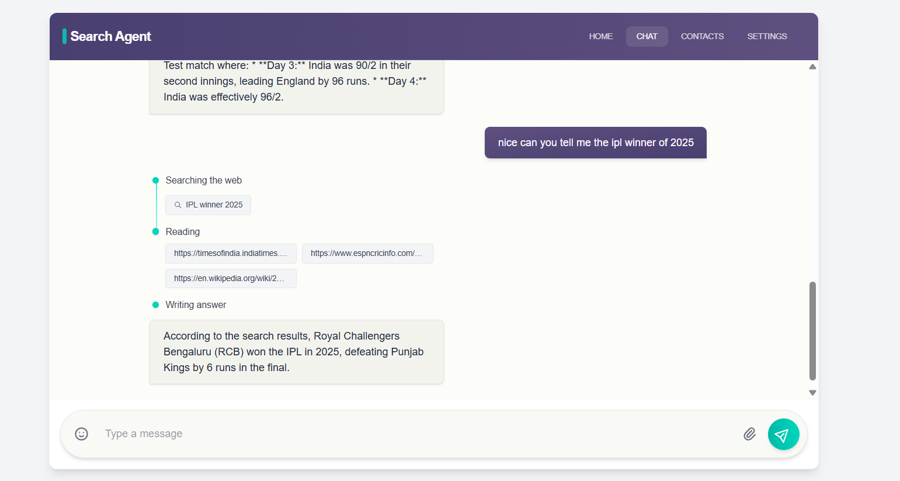
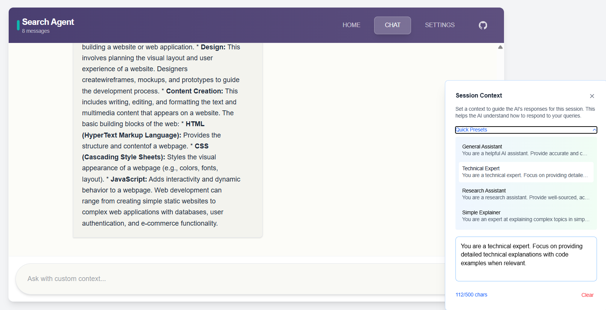

# Search Agent - AI-Powered Web Search Assistant

A modern, responsive AI-powered search application that combines web search capabilities with conversational AI to provide comprehensive answers to user queries.

## ✨ Features

- 🔍 **Intelligent Web Search**: Uses Tavily API for real-time web search
- 🤖 **AI-Powered Responses**: Powered by Google Gemini 2.0 Flash model
- 💬 **Real-time Streaming**: Server-sent events for live response streaming
- 🎯 **Search Progress Tracking**: Visual indicators for search stages
- 📋 **Copy Functionality**: Easy copy-to-clipboard for AI responses
- 🔄 **Session Management**: Start fresh conversations anytime
- 🎨 **Session Context**: Custom prompt engineering for personalized AI responses
- 💡 **Interactive UI**: Modern design with smooth animations

## 📸 Screenshots

### Main Application Interface

*The main chat interface showing real-time AI responses with web search integration*

### Custom Session Context

*Session Context feature allowing users to customize AI behavior with predefined presets or custom prompts*

## 🏗️ Architecture

### Backend (Python/FastAPI)

- **FastAPI**: Modern web framework for building APIs
- **LangGraph**: State management for AI workflows
- **LangChain**: Integration with various AI models and tools
- **Tavily**: Web search API for real-time information retrieval
- **Google Gemini**: Advanced language model for responses

### Frontend (Next.js/React)

- **Next.js 15**: React framework with TypeScript
- **Tailwind CSS**: Utility-first CSS framework for responsive design
- **Server-Sent Events**: Real-time communication with backend
- **TypeScript**: Type-safe development

## 🚀 Setup Instructions

### Prerequisites

- Python 3.8+
- Node.js 18+
- API Keys for:
  - Google Gemini API
  - Tavily Search API

### Backend Setup

1. Navigate to the server directory:

   ```bash
   cd server
   ```

2. Create and activate a virtual environment:

   ```bash
   # Windows
   python -m venv venv
   venv\Scripts\activate

   # macOS/Linux
   python -m venv venv
   source venv/bin/activate
   ```

   ```bash
   python -m venv venv
   venv\Scripts\activate  # Windows
   # or
   source venv/bin/activate  # Linux/Mac
   ```

3. Install dependencies:

   ```bash
   pip install -r requirements.txt
   ```

4. Configure environment variables in `.env`:

   ```env
   GOOGLE_API_KEY=your_google_api_key_here
   TAVILY_API_KEY=your_tavily_api_key_here

   # Optional: LangSmith for debugging
   LANGSMITH_TRACING=true
   LANGSMITH_ENDPOINT="https://api.smith.langchain.com"
   LANGSMITH_API_KEY=your_langsmith_key
   LANGSMITH_PROJECT=your_project_name
   ```

5. Start the backend server:
   ```bash
   uvicorn app:app --reload --host 0.0.0.0 --port 8000
   ```

### Frontend Setup

1. Navigate to the client directory:

   ```bash
   cd client
   ```

2. Install dependencies:

   ```bash
   npm install
   ```

3. Start the development server:
   ```bash
   npm run dev
   ```

The application will be available at:

- Frontend: http://localhost:3000 (or next available port)
- Backend: http://localhost:8000
- Backend Health Check: http://localhost:8000/health

## Usage

1. Open the frontend application in your browser
2. Type your question in the input field
3. Watch as the AI searches the web and compiles a response
4. Copy responses using the copy button

### Navigation

- **Home Tab**: Welcome page with project overview and "Perplexity 2.0" branding
- **Chat Tab**: Main conversational interface with AI search capabilities
- **Settings Tab**: Customize your experience (theme, search preferences, etc.)

### Session Context Feature

1. Click the large **Session Context** button (bottom-right corner)
2. Choose from **Quick Presets**:
   - General Assistant
   - Technical Expert
   - Research Assistant
   - Simple Explainer
3. Or write your own **Custom Context** to guide AI responses
4. The context applies to all messages in the current session

### Chat Features

1. **Ask Questions**: Type your question in the input field
2. **Real-time Responses**: Watch as the AI searches the web and streams responses
3. **Search Progress**: Visual indicators show search stages (searching → reading → writing)
4. **Copy Responses**: Click the copy button on any AI response

### Tips for Better Results

- Use the **Session Context** to specify your role or expertise level
- Ask specific questions for more targeted search results
- Try different contexts for the same question to get varied perspectives

## Development

### Adding New Features

1. **Backend**: Add new endpoints in `app.py` or extend the LangGraph workflow
2. **Frontend**: Add new components in `src/components/` or extend existing functionality

### Environment Variables

The application uses several environment variables:

- `GOOGLE_API_KEY`: Required for AI responses
- `TAVILY_API_KEY`: Required for web search
- `LANGSMITH_*`: Optional for debugging and monitoring

### Performance Tips

- Use specific, focused queries for better search results
- Set appropriate session context to reduce token usage
- Monitor API usage in Google AI Studio and Tavily dashboards


### Building for Production

1. **Backend Deployment**:

   ```bash
   # Install production dependencies
   pip install gunicorn

   # Run with gunicorn
   gunicorn app:app -w 4 -k uvicorn.workers.UvicornWorker --bind 0.0.0.0:8000
   ```

2. **Frontend Build**:

   ```bash
   cd client
   npm run build
   npm start
   ```

3. **Environment Variables**: Set production API keys and endpoints
4. **Security**: Configure CORS, rate limiting, and authentication as needed

## Contributing

1. Fork the repository
2. Create a feature branch
3. Make your changes
4. Test thoroughly
5. Submit a pull request

## License

This project is for educational and development purposes.
